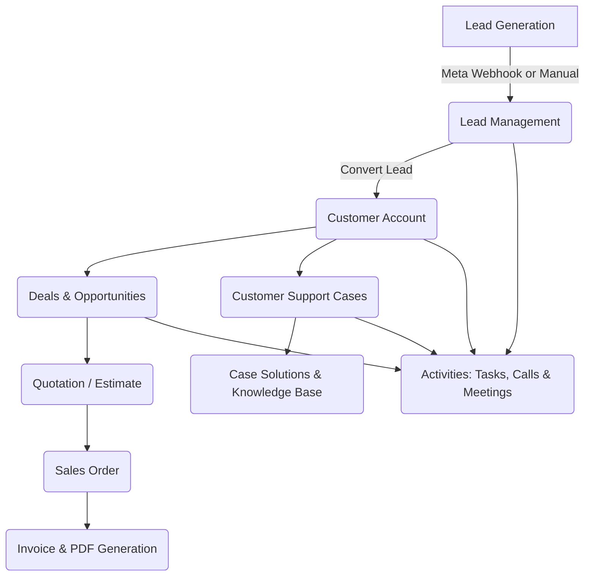

# CRM Backend — System Workflow & Tech Stack Guide

A simple, easy-to-understand, and professional overview of the Customer Relationship Management (CRM) Backend system architecture, business workflows, and key libraries used.

---

## 🛠️ Technologies & Libraries Used

The CRM Backend is built using **Python** and **Django**, structured around RESTful API standards. Below is a breakdown of the core libraries and tools used:

### 1. Core Framework & REST APIs
- **Django 6.0**: The primary web framework providing ORM (database management), security, routing, and administrative features.
- **Django REST Framework (DRF)**: Enables building structured RESTful API endpoints for the frontend application.
- **django-cors-headers**: Manages Cross-Origin Resource Sharing (CORS) so frontend applications can communicate securely with the backend.

### 2. Authentication & Security
- **djangorestframework_simplejwt & PyJWT**: Implements Secure JSON Web Token (JWT) authentication for access and refresh tokens.
- **cryptography & cffi**: Handles secure data encryption and cryptographic operations.

### 3. Database Management
- **SQLite**: Lightweight database used during local development.
- **psycopg2-binary & dj-database-url**: Database adapters used for seamless connection to production **PostgreSQL** databases.

### 4. PDF Generation & Reporting
- **xhtml2pdf & WeasyPrint**: Converts HTML/CSS templates into PDF documents.
- **ReportLab**: High-performance engine used to build downloadable **Invoice**, **Quotation**, and **Purchase Order** PDFs.

### 5. Email & Communication Systems
- **Resend & Django Mail System**: Sends transactional emails, staff invitation links, and notification updates.
- **Custom IPv4 SMTP Backend (`email_backends.py`)**: Forces IPv4 connections to ensure reliable email delivery on cloud hosting environments (e.g., Render, Heroku).

### 6. Integrations & External Services
- **Requests**: HTTP library used to communicate with the **Meta (Facebook Lead Ads) Graph API** and process webhooks.

### 7. Environment & Production Deployment
- **python-dotenv & django-environ**: Securely manages environment variables (`.env`) like API keys and secret database credentials.
- **Gunicorn**: Production-grade WSGI HTTP server used to deploy the backend application.

---

## 🔄 Core System Workflows

---

### Workflow 1: Authentication & Staff Management
1. **Admin Registration / Login**: Admins log in via JWT authentication endpoints (`/api/token/`) to receive secure tokens.
2. **Inviting Staff**: Admins invite team members (Sales Agents, Support Agents, Managers) by generating unique UUID invitation tokens.
3. **Accepting Invitations**: Invited staff members activate their accounts and set up login passwords.

---

### Workflow 2: Lead-to-Customer Conversion
1. **Lead Capture**: Leads are captured manually by staff or automatically via **Meta Ads Webhooks** (Facebook Lead Ads).
2. **Lead Assignment & Notification**: Leads are assigned to specific sales agents, triggering an automated email/in-app notification.
3. **Lead Conversion**: Once a lead is qualified, one click converts the Lead into an active **Customer** record and creates an associated **Deal**.

---

### Workflow 3: Sales, Quotations & Invoicing
1. **Price Books & Products**: Administrators define Products, Services, Vendors, and custom Price Books.
2. **Quotation Creation**: Sales agents create **Quotes** linked to Deals and Customers.
3. **Sales Orders**: Confirmed quotes convert into formal **Sales Orders**.
4. **Invoicing & PDF Export**: Sales orders generate an **Invoice**. The system automatically creates a downloadable, formatted PDF Invoice for the customer.

---

### Workflow 4: Procurement & Vendor Management
1. **Vendor Records**: Vendors and their product offerings are registered in the system.
2. **Purchase Orders**: Staff create **Purchase Orders (POs)** to track stock orders placed with vendors.
3. **Order Status Tracking**: Purchase order states update from `Created` $\rightarrow$ `Sent` $\rightarrow$ `Confirmed` $\rightarrow$ `Received`.

---

### Workflow 5: Customer Support & Resolution
1. **Case Creation**: Customers or support agents log support tickets/cases via phone, email, or chat.
2. **Case Solutions (Knowledge Base)**: Support agents reference published **Case Solutions** to resolve issues faster.
3. **Case Tracking**: Issues move from `Open` to `In Progress` to `Resolved` and `Closed`.

---

### Workflow 6: Tasks, Meetings & Notifications
1. **Scheduling Activities**: Staff log tasks, inbound/outbound calls, and meetings (online via Zoom/Google Meet/Teams or in-office).
2. **Automated Reminders**: The system tracks task deadlines and meeting schedules, pushing reminders to staff via email and in-app bell notifications.

---

## 📌 Summary

This CRM Backend provides a comprehensive, multi-company architecture covering:
- **Lead Generation & Sales Automation**
- **Financial Document Processing (Quotes, Orders, Invoices, PDFs)**
- **Customer Support & Knowledge Management**
- **Team Collaboration & Activity Tracking**
